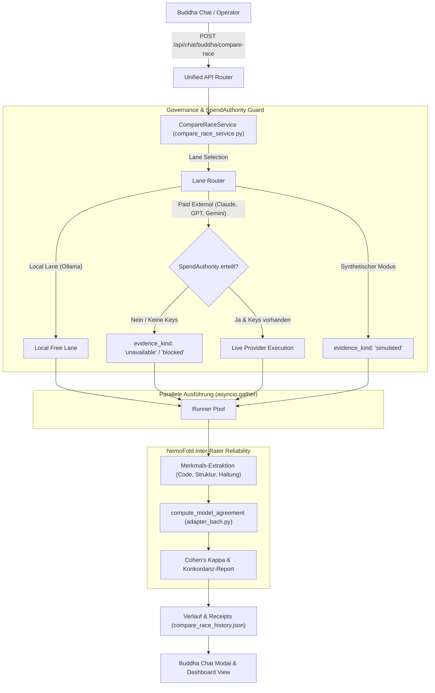
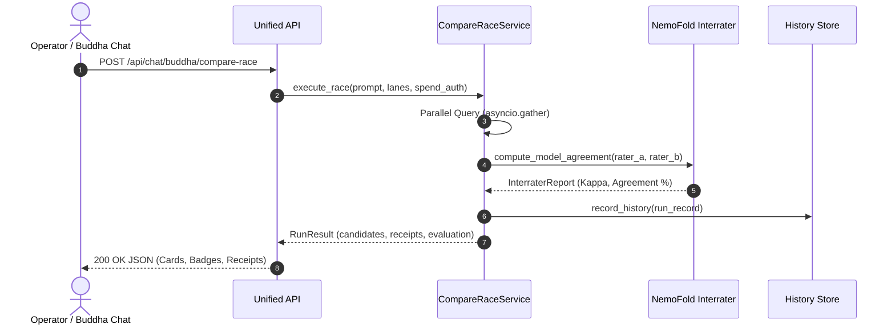

# Buddha-Chat Compare-Race: Multi-Modell Evaluation & Inter-Rater Reliability v1

## 1. Übersicht & Zielsetzung

Das **Buddha-Chat Compare-Race** (Task #1690 & Task #1676, Ticket `T-20261003-605028960` / GUX-075) stellt eine parallele Abfrage- und Antwortvergleichs-Architektur zwischen mehreren lokalen und externen Modell-Kandidaten im Buddha-Chat bereit.

### Kernprinzipien (GUX-075 Konformität):
1. **Wirkliche parallele Provider-/Modellausführung:**
   - Echte nebenläufige Ausführung über konfigurierte Spuren (Lanes) mittels `asyncio.gather`.
   - Lokale Open-Source-Modelle (Ollama, Slots) laufen direkt, kostenfrei und privat.
2. **Strikte SpendAuthority-Kostenreservierung:**
   - Kommerzielle, kostenpflichtige APIs (Claude/Anthropic, GPT/OpenAI, Gemini/Google) erfordern eine explizite Vorab-Genehmigung (`SpendAuthority`).
   - Ohne SpendAuthority oder ohne API-Schlüssel wird das Ergebnis strikt als `evidence_kind: "unavailable"` / `status: "blocked"` mit 0.00 ct Kosten verbucht — **kein Vorspiegeln von Erfolgen oder Faken von Modellergebnissen**.
3. **Deterministische Test- und Abnahme-Fixtures:**
   - Für CI-, Test- und Abnahmezwecke stehen synthetische Fixtures (`synthetic_fixture_a`, `synthetic_fixture_b`) zur Verfügung.
   - Sie tragen transparent `evidence_kind: "simulated"` und verursachen 0.00 ct Kosten.
4. **NemoFold Inter-Rater-Reliabilität:**
   - Statistische Auswertung über das NemoFold-Subsystem (`imported_capabilities/category_2_superior_solutions/interrater/adapter_bach.py`).
   - Berechnung von **Cohen's Kappa ($\kappa$)** und prozentualer Konkordanz über strukturierte Antwortmerkmale.

---

## 2. Architektur & Workflow



---

## 3. Belegarten (Evidence Kind Taxonomy)

Gemäß GUX-075 trägt jedes Kandidatenergebnis eine transparente `evidence_kind`-Klassifikation:

| `evidence_kind` | Bedeutung | Farbe / Badge | Kosten |
| :--- | :--- | :--- | :--- |
| `live` | Echte Ausführung gegen ein erreichbares Modell (lokal oder autorisiert) | 🟢 `LIVE` | Gemessen / 0 ct (lokal) |
| `simulated` | Deterministischer Test-Fixture für CI/Abnahme | 🟡 `SIMULATED` | 0.00 ct |
| `blocked` | Aufruf durch SpendAuthority-Richtlinie oder Budgetgrenze blockiert | 🟠 `BLOCKED` | 0.00 ct |
| `unavailable` | Provider nicht konfiguriert oder API-Schlüssel fehlt | 🔴 `UNAVAILABLE` | 0.00 ct |
| `failed` | Technischer Fehler / Timeout beim Modellaufruf | ❌ `FAILED` | 0.00 ct |
| `manual` | Manuelle Bewertung / Operator-Eingabe | ⚪ `MANUAL` | 0.00 ct |

---

## 4. REST-API Spezifikation

### `GET /api/chat/buddha/compare-race/lanes`
Liefert alle verfügbaren Kandidaten-Spuren mit aktuellem Status und Kostenpflichtigkeit.
```json
{
  "lanes": [
    {
      "id": "ollama",
      "name": "Ollama Lokal (Qwen / Llama)",
      "provider": "ollama",
      "model": "qwen3.8:27b-mlx",
      "is_paid": false,
      "requires_auth": false,
      "available": true,
      "status": "ready",
      "evidence_kind": "live"
    },
    {
      "id": "claude",
      "name": "Claude 3.7 Sonnet (Anthropic)",
      "provider": "anthropic",
      "model": "claude-3-7-sonnet",
      "is_paid": true,
      "requires_auth": true,
      "available": false,
      "status": "blocked",
      "evidence_kind": "unavailable",
      "status_message": "SpendAuthority nicht erteilt (Kostenfreigabe erforderlich)"
    }
  ],
  "checked_at": "2026-10-05T12:30:00Z"
}
```

### `POST /api/chat/buddha/compare-race`
Startet ein paralleles Multi-Modell Race.
- **Request:**
```json
{
  "prompt": "Vergleiche Microservices vs. Monolith",
  "models": ["synthetic_fixture_a", "synthetic_fixture_b"],
  "synthetic_fixtures": true,
  "spend_authority": {
    "approved": false,
    "max_budget_cents": 0.0
  }
}
```

- **Response:**
```json
{
  "run_id": "race-b4a1c8f9",
  "prompt": "Vergleiche Microservices vs. Monolith",
  "timestamp": "2026-10-05T12:30:15Z",
  "candidates": [
    {
      "lane_id": "synthetic_fixture_a",
      "name": "Synthetischer Prüfrater Alpha (Test)",
      "model": "synthetic-rater-alpha",
      "evidence_kind": "simulated",
      "status": "ready",
      "latency_ms": 48,
      "score": 0.88,
      "response": "### Analyse von Rater Alpha...",
      "receipt": {
        "evidence_kind": "simulated",
        "spend_authorized": false,
        "actual_cost_cents": 0.0,
        "tokens_input": 4,
        "tokens_output": 42
      }
    }
  ],
  "evaluation": {
    "status": "evaluated",
    "schema": "nemofold.interrater.v1",
    "pairwise": [
      {
        "rater_a": "synthetic_fixture_a",
        "rater_b": "synthetic_fixture_b",
        "items_compared": 6,
        "agreed_items": 5,
        "agreement_percent": 83.33,
        "cohens_kappa": 0.6522,
        "kappa_note": "computed"
      }
    ],
    "overall_agreement_percent": 83.33,
    "overall_kappa": 0.6522,
    "evaluated_pairs_count": 1
  },
  "winner": "synthetic_fixture_a"
}
```

---

## 5. Sequence Diagram


