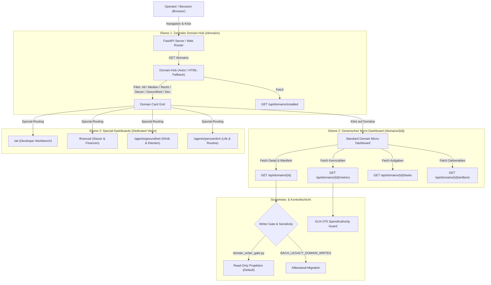
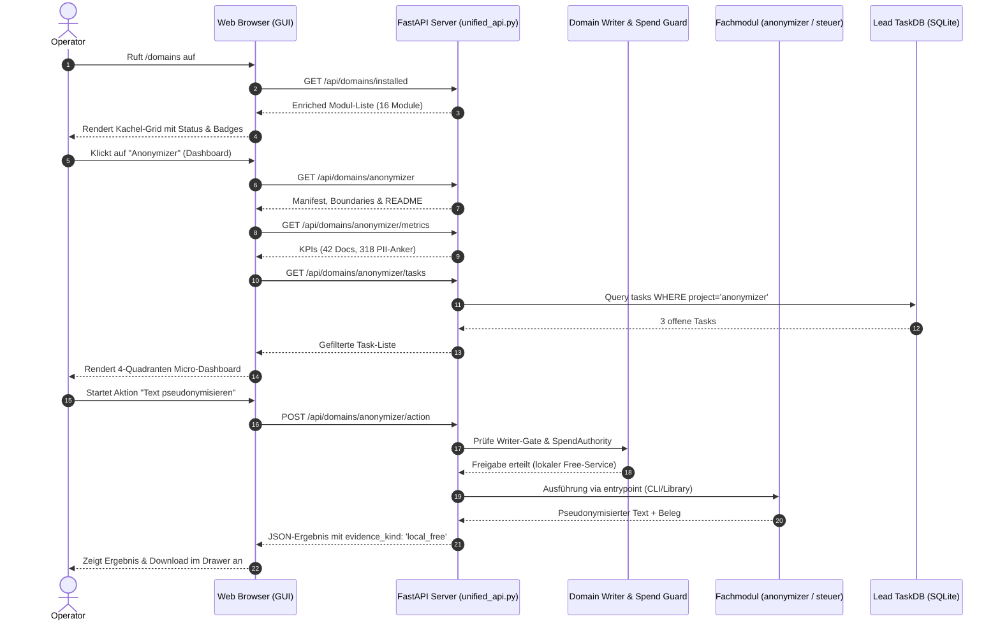

# .DOMAINS-Dashboards: Architektur- & Design-Plan v1

| Metadatum | Wert |
|---|---|
| **Dokument-ID** | `DOMAINS-DASHBOARDS-PLAN-v1` |
| **Milestone** | **M5: .DOMAINS-Dashboards (nur Planung)** |
| **Tasks** | Task #1677 (`M5: .DOMAINS-Dashboards (nur Planung)`), Vorgänger: Task #1676 (`M4: Compare-Race-View`) |
| **Kategorie** | GUI / Architektur / Spezifikation |
| **Status** | Konzept & Spezifikation (Reine Planung — keine Implementierung in M5) |
| **Datum** | 2026-10-05 |
| **Autoren** | Gemini (Autonomous Lead / Pair Programming Worker) & BACH Contributors |
| **Gültigkeit** | Ab BACH v4.3.65 / GUX-075 |

---

## 1. Executive Summary & Problemstellung

### 1.1 Zielsetzung & M5-Auftrag
Im Rahmen von Milestone **M5** (Task #1677) wird das **Architektur- und Designkonzept für die `.DOMAINS`-Dashboards** verbindlich spezifiziert. Gemäß Aufgabenstellung (*"nur Konzept/Design, keine Implementierung"*) liefert dieses Dokument den vollständigen Bauplan für die zukünftige Realisierung (ab Milestone M6), ohne vorzeitig Code zu verändern oder unfertige Prototypen in die Codebasis einzubringen.

### 1.2 Ist-Zustand & Kernprobleme
Die bisherige Frontend- und Domänenlandschaft in BACH weist eine historisch gewachsene Fragmentierung auf:
1. **Verteilte Einzel-Dashboards ohne gemeinsamen Rahmen:**
   - Dedizierte Custom-Templates existieren für `/ati` (Entwickler-Taskboard), `/agents/persoenlich` (Persönlicher Assistent), `/financial` bzw. `/steuer` (Theodor Steuer) und `/agents/gesundheit` (Klinik & Klientenakte).
   - Jedes dieser Dashboards verwendet unterschiedliche Layout-Strukturen, Styling-Ansätze und API-Verträge.
2. **Ungedeckte Fachmodule in `.DOMAINS`:**
   - In `OneDrive\.TOPICS\.AI\.MODULES\.DOMAINS\` existieren 13 hochspezialisierte Fachmodule (z. B. `ai-media-editor`, `anonymizer`, `law-checker`, `report-forge`, `foerderplaner`, `steuer-suite`, `doc-services`, `worksheet-generator`, `paveman`, `ellmos-market-data`).
   - Mehr als 9 dieser Fachmodule besitzen bislang **keine eigene visuelle Benutzeroberfläche** und werden in `/domains` lediglich als statische Kacheln ohne Detail-Dashboard dargestellt.
3. **Hardcodierte Listen statt deklarativer Manifest-Discovery:**
   - Das Endpoint `/api/domains/installed` führt hardcodierte Mapping-Dictionaries (`icon_map`, `desc_map`) und statische Repo-Einträge (`ati`, `theodor-steuer`, `gesundheit`), anstatt die standardisierten `ellmos.module.v2.json`-Manifeste der Domänen dynamisch auszulesen.
4. **Fehlende Vereinheitlichung von Metriken, Tasks und Sicherheit:**
   - Es fehlt ein einheitlicher Metriken- und Status-Vertrag (`/api/domains/{id}/metrics`), der Kennzahlen (KPIs), offene Tasks aus der zentralen TaskDB und generierte Artefakte strukturiert an ein universelles Dashboard-Layout liefert.
   - Sicherheitsgrenzen (wie `domain_writer_gate.py` und GUX-075 SpendAuthority) sind in den bestehenden Views visuell nicht verankert.

### 1.3 Vision des Zielzustands (Soll-Konzept)
Mit dem vorliegenden Plan wird eine standardisierte **Slot-Architektur v2** etabliert:
- **Ebene 1 (Zentraler Domain-Hub `/domains`):** Einheitlicher Einstiegspunkt mit globaler KPI-Leiste, Kategorien-Filter (Medien, Recht, Steuern, Gesundheit, Dev), Live-Status-Badges und Suchfunktion.
- **Ebene 2 (Standardisiertes Domain-Micro-Dashboard `/domains/{id}`):** Ein universelles 4-Quadranten-Layout für *jedes* Fachmodul mit Identity-Header, 4 KPIs, operationsbezogenen Tabs (Aktionen, TaskDB-Aufgaben, Artefakte, Konfiguration) und Kontext-Sidebar (Agenten, Memory, Gate-Status).
- **Ebene 3 (Spezialisierte Fach-Dashboards):** Nahtlose Integration bestehender Voll-Dashboards (`/ati`, `/financial`, `/persoenlich`, `/gesundheit`) als Spezial-Erweiterungen unter Wahrung der gemeinsamen GUX-Designstandards.

---

## 2. Forensische Bestandsaufnahme (Die `.DOMAINS`-Struktur)

### 2.1 Speicherort & Topologie
Die Fachmodule sind in zwei korrespondierenden Verzeichnisbäumen verortet:
1. **OneDrive-Fachmodul-Speicher:**
   `C:\Users\User\OneDrive\.TOPICS\.AI\.MODULES\.DOMAINS\`
   Enthält die Fachmodule mit Domänenwissen, Modul-Manifesten, Dokumentation und persistenten Nutzdaten.
2. **Lokaler Entwicklungsbaum (Repo-Klone):**
   `C:\_Local_DEV\repos\<modul-name>\`
   Enthält die Git-Repositories mit Quellcode, Testsuiten und Build-Konfigurationen.

### 2.2 Inventar der 13 Fachmodule & 3 Entwickler-Domänen

| Modul-ID | Name | Kategorie | Sichtbarkeit / Sensibilität | Bereitgestellte Fähigkeiten (Provides) | Status |
|---|---|---|---|---|---|
| `ai-media-editor` | AI Media Editor | Medien & Audio | Privat (Sensibel) | Multi-Track Video, KI-Schnitt, B-Roll, Waveform | Aktiv |
| `media-editor-core` | Media Editor Core | Medien & Audio | Intern | High-Performance Rendering-Kern (C++/Python) | Planned |
| `clip-storyboard-director`| Storyboard Director| Medien & Video | Public (Open Source)| Szenen- & Storyboard-Planung, Timeline-Schema | Released |
| `anonymizer` | Anonymizer | Recht & Privacy | Public (Open Source)| `privacy.anonymize`, `privacy.pseudonymize` | Released (0.3.1) |
| `law-checker` | Law Checker | Recht & Compliance| Public (Open Source)| Paragraphen- & Urteilsprüfung, Belegdisziplin | Released (Alpha) |
| `steuer-assistent` | Steuer Assistent | Steuern & Finanzen| Public (Open Source)| Beleg-Arbeitsunterlage, Werbungskosten (EStG) | Released (Alpha) |
| `steuer-suite` | Steuer Suite | Steuern & Finanzen| **PRIVAT / never-public** | `tax.receipt-pipeline`, `tax.bank-matching` | Development |
| `ellmos-market-data` | Market Data Service | Finanzen & Daten | Public (Open Source)| yfinance-Integration, Watchlists, SQLite-Feed | Development |
| `theodor-steuer` | Theodor Steuer (Repo)| Steuern & Finanzen| Intern / Service | Elster-Schnittstelle, Kontenabgleich, EUR | Aktiv |
| `foerderplaner` | Förderplaner | Gesundheit & Pädag.| **PRIVAT / sensibel** | `domain.foerderplanung`, `domain.icf` | Development |
| `worksheet-generator` | Worksheet Generator| Pädagogik & Förd. | Public (Open Source)| Material-Scan, ICF-Steuerung, PDF/DOCX-Export | Released (Alpha) |
| `gesundheit` | Gesundheit (Repo) | Gesundheit & Klinik | **PRIVAT / sensibel** | Klientenakte, Verlauf, Psychologie, Notizen | Aktiv |
| `report-forge` | Report Forge | Reporting & Text | Public (Open Source)| Anonymisierbare Berichts-Pipelines, Word-Vorlagen | Released (Alpha) |
| `paveman` | Paveman | Infrastruktur | Public (Open Source)| Straßen- & Verkehrsdaten-Analyse | Released |
| `doc-services` | Doc Services | Dokumente & OCR | Public (Open Source)| PDF-, OCR-, Markdown- & Format-Konvertierung | Released |
| `ati` | ATI Entwickler (Repo)| Entwickler & Core | Intern / Core | Unified TaskDB, Runner, Code-Workbench | Aktiv |

### 2.3 Deklarative Manifeste (`ellmos.module.v2.json`)
Die Module in `.DOMAINS` nutzen überwiegend das Schema `ellmos.module.v2`. Dieses Manifest liefert standardmäßig:
- **Identität:** `id`, `display_name`, `version`, `description`, `category`, `kind` (`service`, `workflow`, `library`, `app`).
- **Grenzwerte & Isolation (`boundaries`):**
  - `network`: `"none"`, `"listed"`, `"optional"`.
  - `data`: `"sensitive"` (strikt lokal, DSGVO-relevant) vs. `"public"`.
  - `platforms`: `["windows", "macos", "linux"]`.
- **Sichtbarkeit:** `"public"`, `"internal"`, `"private"`.
- **Fähigkeiten:** `provides`, `requires`, `optional`, `conflicts`.
- **Schnittstellen (`surfaces`):** `["library", "cli", "workflow", "api", "gui"]`.

---

## 3. Analyse bestehender Dashboard-Ansätze

### 3.1 `system/gui/web/src/pages/domains.astro` (Astro Slot View v2)
- **Konzept:** Astro-basierte Komponente, die zur Build-Zeit nach `system/gui/web/dist/domains.html` kompiliert und von FastAPI ausgeliefert wird.
- **Stärken:** Modernes Design, Quick-Stats-Karten, responsives Grid, Einbindung des ATI-Entwickler-Taskboards.
- **Schwächen:** 
  - Klick auf ein Fachmodul öffnet lediglich ein JavaScript-`alert()` mit dem Pfad (außer bei `ati`, `steuer`, `gesundheit`).
  - Keine Unterseiten oder Micro-Dashboards für Module wie `anonymizer` oder `law-checker`.
  - Harte Abhängigkeit von Node/Astro für Code-Änderungen.

### 3.2 `system/gui/templates/ati.html` (ATI Developer Workbench)
- **Konzept:** Reines HTML/Jinja2-Template mit Inline-CSS und Vanilla-JavaScript.
- **Stärken:** 4 standardisierte KPI-Karten (Tasks, Sessions, Memory, Health), zwei-spaltiges Layout (Task-Liste links, Worker-Log/Aktionen rechts), direkte Anbindung an `/api/tasks`.
- **Lerneffekt:** Dieses Layout eignet sich ideal als Vorlage für das generische Micro-Dashboard!

### 3.3 `system/gui/templates/persoenlich.html` (Persönlicher Assistent)
- **Konzept:** Lebensbereichs- und Organisations-Dashboard.
- **Stärken:** 4 farbcodierte KPI-Karten (Kalender, Tasks, Schnellzugriffe, Routinen), Feature-Grid mit Direktsprungmarken zu Subsystemen (`/chat`, `/prompt-library`, `/routinen`, `/kontakte`, `/denkarium`, `/wiki`), Verlinkung verwandter Fachagenten.
- **Lerneffekt:** Zeigt, wie Querverbindungen zwischen Domänen und allgemeinen Assistenzfunktionen elegant geführt werden.

### 3.4 `system/gui/templates/financial.html` & `theodor-steuer`
- **Konzept:** Tab-gestützte Ansicht für Konten, Belege, Steuerkategorien und Buchungssätze.
- **Stärken:** Tab-Navigation (Übersicht, Konten, Belege, Elster), aggregierte Finanzsummen, strukturierte Datentabellen.
- **Lerneffekt:** Dient als Referenz für stark strukturierte, tabellarische Fachdomänen.

---

## 4. Ziel-Architektur: Die .DOMAINS-Dashboard Suite

### 4.1 Gesamtarchitektur & Datenfluss



---

### 4.2 Ebene 1: Zentraler Domain-Hub (`/domains`)

Der zentrale Domain-Hub dient als single point of entry für alle installierten Fachmodule.

#### UI-Komponenten des Hubs:
1. **Globaler Header:**
   - Titel: `🌐 Meine Domänen & Fachmodule`
   - Subtitel: `Zentrale Übersicht der installierten Fachdomänen, Daten-Isolate und Spezialwerkzeuge`
   - Globales Suchfeld (Live-Filterung nach Name, Capability, Tag).
2. **Kategorie-Pills (Tab-Filter):**
   - `Alle` (Gesamtzahl aller Module)
   - `🎬 Medien & Audio` (`ai-media-editor`, `media-editor-core`, `clip-storyboard-director`)
   - `⚖️ Recht & Datenschutz` (`law-checker`, `anonymizer`)
   - `💰 Steuern & Finanzen` (`steuer-assistent`, `steuer-suite`, `theodor-steuer`, `ellmos-market-data`)
   - `🩺 Gesundheit & Bildung` (`foerderplaner`, `worksheet-generator`, `gesundheit`)
   - `🛠️ Entwickler & System` (`ati`, `doc-services`, `report-forge`, `paveman`)
3. **Globale KPI-Leiste (Quick Stats):**
   - **Installierte Module:** Gesamtzahl der erkannten Fachmodule (z. B. `16`).
   - **Aktive Services:** Anzahl der betriebsbereiten / gestarteten Dienste (z. B. `7`).
   - **Offene Aufgaben:** Summe aller domänenspezifischen Tasks aus der TaskDB (z. B. `24`).
   - **Sensible Speicher:** Anzahl als privat/sensibel markierter Isolate (z. B. `3`).
4. **Modul-Kacheln (Domain Cards):**
   Jede Kachel visualisiert:
   - **Icon & Titel:** Domänenspezifisches Icon, Name und Kategorie.
   - **Sensibilitäts- & Status-Badge:**
     - 🟢 `Aktiv / Ready`
     - 🟡 `Development / Staging`
     - 🔒 `Sensibel (Lokal / Air-gapped)`
     - 🌐 `Open Source (Public)`
   - **Beschreibung:** Kompakte Zusammenfassung der fachlichen Rolle.
   - **Bereitgestellte Capabilities:** Badges für `provides` (z. B. `privacy.anonymize`, `domain.icf`).
   - **Aktions-Buttons:**
     - `Dashboard ↗`: Öffnet das Micro-Dashboard `/domains/{id}` (oder die Spezial-View).
     - `Ordner 📂`: Zeigt den lokalen Pfad bzw. öffnet den Dateibrowser.
     - `Manifest 📄`: Öffnet ein Modal mit der Rohkonfiguration (`ellmos.module.v2.json`).

---

### 4.3 Ebene 2: Standardisiertes Domain Micro-Dashboard (`/domains/{id}`)

Für Module ohne eigenes dediziertes Frontend (wie `anonymizer`, `law-checker`, `worksheet-generator`, `report-forge`, `ai-media-editor`, `doc-services`) wird ein einheitliches, hochfunktionales **4-Quadranten-Layout** spezifiziert.

#### Layout-Struktur des Micro-Dashboards:

```
+----------------------------------------------------------------------------------------------------+
| [Icon] Domänen-Titel & ID                       [Status: 🟢 Aktiv] [Sensibilität: 🔒 Sensibel]      |
| Kurzbeschreibung & Pfad (OneDrive / Repo)       [Button: 🔄 Aktualisieren] [Button: ⚙️ Konfiguration]|
+----------------------------------------------------------------------------------------------------+
|                                      KPI / METRIKEN-LEISTE                                         |
| +--------------------+ +--------------------+ +--------------------+ +--------------------+       |
| |   Primäre Metrik   | |  Offene Aufgaben   | |     Artefakte      | |    System-Health   |       |
| |       [Wert]       | |    [Anzahl/Prio]   | |    [Generiert]     | |   [100% OK / Gate] |       |
| +--------------------+ +--------------------+ +--------------------+ +--------------------+       |
+--------------------------------------------------------------------+-------------------------------+
|                        HAUPT-OPERATIONSBEREICH                     |       KONTEXT & GOVERNANCE    |
| [Tabs: ⚡ Aktionen & Workflows | 📋 Aufgaben | 📁 Artefakte | 📜 Doku]|                               |
|                                                                    | 🛡️ Writer Gate: Read-Only     |
| [Tab-Inhalt je nach aktivem Tab]:                                  | 🔒 Datensensibilität: Hoch    |
| - Aktionen: Direkte Aktions-Buttons (z. B. "Text anonymisieren",   | 💰 SpendAuthority: 0.00 ct    |
|   "Beleg scannen", "Gutachten prüfen") mit Parametern.             |                               |
| - Aufgaben: Interaktives Taskboard, gefiltert auf diese Domäne     | 🤖 Verknüpfte Agenten:        |
|   mit Checkboxen, Statuswechsel und Zuweisung.                     | - Theodor (Steuer-Experte)    |
| - Artefakte: Tabelle der generierten Dokumente, Berichte, PDFs     | - Hermes (Skill-Learner)      |
|   mit 1-Klick-Download und Inhalts-Vorschau.                       |                               |
| - Doku: Vollständig gerenderte README.md / BEWEISNOTIZ.md.         | 🧠 Memory / Knowledge-Feed:   |
|                                                                    | - Letzte Synthese vor 2h      |
+--------------------------------------------------------------------+-------------------------------+
```

#### Spezifikation der 4 Quadranten:
1. **Quadrant 1 (Identity & Header):**
   - Modulname, Versionsnummer, Paketname.
   - Statusanzeige: `Aktiv`, `Entwicklung`, `Inert / Gated`.
   - Quell-Link (GitHub-URL oder lokales Verzeichnis).
2. **Quadrant 2 (KPI / Metriken):**
   - 4 standardisierte Kennzahlen-Karten. Die Kennzahlen werden über den Adapter `/api/domains/{id}/metrics` geliefert (z. B. bei `anonymizer`: Anonymisierte Wörter, Geschützte Entitäten, Verarbeitete Dokumente, Ausführungszeit).
3. **Quadrant 3 (Haupt-Operationsbereich mit Tabs):**
   - **Tab 1: Schnellaktionen & Workflows:**
     - Ausführbare Aktionen aus `surfaces: ["workflow", "cli"]`.
     - Parameter-Formular mit Validierung.
     - Ausgabe-Drawer mit Live-Status und Fehlerrückmeldung.
   - **Tab 2: Aufgaben (Taskboard):**
     - Automatische Filterung aus der Lead TaskDB: Aufgaben, deren `category`, `project` oder Tags der Modul-ID entsprechen.
     - Inline-Aktionen: Status setzen (`in_progress`, `done`), Prioritäts-Filter (P1, P2, P3).
   - **Tab 3: Artefakte & Exporte:**
     - Gefilterte Liste aller generierten Dateien der Domäne.
     - Spalten: Dateiname, Erstellungsdatum, Größe, Typ, Aktionen (Vorschau, Download).
   - **Tab 4: Modul-Dokumentation & Manifest:**
     - Inline-Markdown-Viewer für `README.md`, `CHANGELOG.md` und das Rohmanifest `ellmos.module.v2.json`.
4. **Quadrant 4 (Kontext & Governance Sidebar):**
   - **Writer-Gate-Status:** Anzeige, ob die Domäne unter `domain_writer_gate.py` fällt (Read-Only Projektion vs. freigegeben).
   - **Datenschutz & Boundaries:** Anzeige der Netzwerkberechtigungen (`network: none`) und Plattformunterstützung.
   - **Verknüpfte Agenten & Rollen:** Welche System-Agenten (z. B. `ati`, `theodor`, `hermes`) für diese Domäne zuständig sind.
   - **Recent Activity Log:** Chronologischer Verlauf der letzten Aktionen und Modulaufrufe.

---

### 4.4 Ebene 3: Spezifische Erweiterungspläne für Schlüssel-Domänen

Für die 5 wichtigsten Domänenfamilien werden maßgeschneiderte Spezial-Widgets und Workflows spezifiziert:

```mermaid
graph TD
    classDef media fill:#2b1b3d,stroke:#a855f7,stroke-width:2px,color:#fff;
    classDef tax fill:#1b3d2b,stroke:#22c55e,stroke-width:2px,color:#fff;
    classDef law fill:#3d2b1b,stroke:#f59e0b,stroke-width:2px,color:#fff;
    classDef health fill:#1b2b3d,stroke:#3b82f6,stroke-width:2px,color:#fff;
    classDef dev fill:#333333,stroke:#94a3b8,stroke-width:2px,color:#fff;

    Hub["🌐 Zentraler Domain-Hub"] --> Media["🎬 Medien & Audio"]
    Hub --> Tax["💰 Steuern & Finanzen"]
    Hub --> Law["⚖️ Recht & Datenschutz"]
    Hub --> Health["🩺 Gesundheit & Pädagogik"]
    Hub --> Dev["🛠️ Entwickler & System"]

    Media --> M1["ai-media-editor (Timeline & B-Roll)"]:::media
    Media --> M2["clip-storyboard-director (Szenen)"]:::media
    Media --> M3["media-editor-core (Renderer)"]:::media

    Tax --> T1["theodor-steuer (Elster & Konten)"]:::tax
    Tax --> T2["steuer-suite (Bank-Matching & SKR04)"]:::tax
    Tax --> T3["steuer-assistent (Werbungskosten)"]:::tax
    Tax --> T4["ellmos-market-data (Kurse & Charts)"]:::tax

    Law --> L1["law-checker (Paragraphen & Urteile)"]:::law
    Law --> L2["anonymizer (NER-Pseudonymisierung)"]:::law

    Health --> H1["gesundheit (Klientenakte & Verlauf)"]:::health
    Health --> H2["foerderplaner (ICF-Ziele & Store)"]:::health
    Health --> H3["worksheet-generator (Materialien)"]:::health

    Dev --> D1["ati (TaskDB & Code Workbench)"]:::dev
    Dev --> D2["report-forge (Berichts-Pipeline)"]:::dev
    Dev --> D3["doc-services (PDF & OCR)"]:::dev
```



#### 1. Medien-Studio (`ai-media-editor`, `clip-storyboard-director`, `media-editor-core`):
- **Spezifische KPIs:** Vorhandene Schnittprojekte, Gerenderte Minuten, Render-Queue-Status, Audio-Spuren.
- **Widgets:**
  - *Timeline- & Storyboard-Viewer:* Visuelle Repräsentation von Szenen-Blöcken und Übergängen.
  - *Render-Queue-Monitor:* Lokale FFmpeg-/Core-Job-Überwachung mit Fortschrittsbalken.
  - *Waveform- & Transkript-Inspektor:* Schnelle Vorschau synchronisierter Audiospuren.

#### 2. Steuer- & Finanz-Zentrale (`theodor-steuer`, `steuer-suite`, `steuer-assistent`, `ellmos-market-data`):
- **Spezifische KPIs:** Einnahmen/Ausgaben (EUR), Ungeprüfte Belege, Bank-Matching-Quote (%), EStG-Kategorie-Status.
- **Widgets:**
  - *Beleg-Upload & OCR-Dropper:* Direkter PDF/Scan-Import zur automatischen Texterkennung.
  - *Bankabgleich-Diff:* Gegenüberstellung von CAMT-Kontoauszügen und Belegbeträgen.
  - *Market-Watchlist:* Kompaktes yfinance-Widget mit Kursverläufen relevanter Indizes.

#### 3. Rechts- & Datenschutz-Suite (`law-checker`, `anonymizer`):
- **Spezifische KPIs:** Gescannte Dokumente, Erkannte PII-Entitäten, Verifizierte BGB/SGB-Zitate, Anonymisierungs-Level.
- **Widgets:**
  - *Split-Screen Anonymisierungs-Editor:* Originaltext links (rot markierte PII), anonymisierter Text rechts (grüne Pseudonym-Anker).
  - *Gesetzes-Zitier-Verifikator:* Automatische Prüfung von Gesetzestext-Referenzen gegen kanonische Normdatenbanken.

#### 4. Therapie- & Bildungs-Hub (`foerderplaner`, `worksheet-generator`, `gesundheit`):
- **Spezifische KPIs:** Aktive Förderfälle, Erreichte ICF-Ziele, Generierte Übungsblätter, Anonymisierungs-Siegel.
- **Widgets:**
  - *ICF-Kompetenz-Radar:* Visuelle Darstellung motorischer, kognitiver und sozialer Förderziele.
  - *Arbeitsblatt-Designer:* 1-Klick-Generierung von Arbeitsblättern aus Markdown/HTML mit Word-Export.
  - *Klienten-Verlaufsgraph:* Chronologischer Notizen- und Verlaufs-Feed (strikt lokal, unverschlüsselt nie im Cloud-Sync).

#### 5. Entwickler- & System-Workbench (`ati`, `report-forge`, `doc-services`, `paveman`):
- **Spezifische KPIs:** Offene Backlog-Tasks, Green Test Suites (%), Aktive Worktrees, API-Health.
- **Widgets:**
  - *Unified Taskboard:* Direktes Claiming, Starten und Abschließen von Aufgaben.
  - *Repo- & Worktree-Navigator:* Schnellwechsel zwischen isolierten Entwicklungszweigen.

---

## 5. Backend-API-Vertrag & Spezifikation

Zur sauberen Entkopplung von Frontend und Backend wird die REST-API um standardisierte Domänen-Routen erweitert:

### 5.1 Endpunkte-Übersicht

```
GET  /api/domains                     -> Liste aller Domänen (Root + Repos)
GET  /api/domains/installed           -> Enriched-Scan aller .DOMAINS-Manifeste
GET  /api/domains/{id}                -> Detail-Manifest, README, Konfiguration
GET  /api/domains/{id}/metrics        -> Spezifische Kennzahlen & Health-Status
GET  /api/domains/{id}/tasks          -> Aus TaskDB gefilterte Aufgaben
GET  /api/domains/{id}/artifacts      -> Generierte Dateien der Domäne
POST /api/domains/{id}/action         -> Ausführung eines Modul-Workflows
```

### 5.2 JSON-Schemas (Data Contracts)

#### 1. Schema: `GET /api/domains/installed` (Auszug)
```json
{
  "domains": [
    {
      "id": "anonymizer",
      "name": "Anonymizer",
      "version": "0.3.1",
      "category": "domains",
      "kind": "service",
      "status": "released",
      "visibility": "public",
      "icon": "🎭",
      "description": "Fail-closed pseudonymization service for sensitive local documents.",
      "folder": "C:\\Users\\User\\OneDrive\\.TOPICS\\.AI\\.MODULES\\.DOMAINS\\anonymizer",
      "has_readme": true,
      "has_manifest": true,
      "provides": ["privacy.anonymize", "privacy.pseudonymize"],
      "boundaries": {
        "network": "none",
        "data": "sensitive",
        "platforms": ["windows", "macos", "linux"]
      },
      "custom_dashboard_url": null
    }
  ],
  "total": 16
}
```

#### 2. Schema: `GET /api/domains/{id}/metrics`
```json
{
  "domain_id": "anonymizer",
  "health": "healthy",
  "gate_status": {
    "writer_gated": false,
    "legacy_migration_active": false,
    "mode": "read_write_local"
  },
  "kpis": [
    {
      "id": "processed_docs",
      "label": "Verarbeitete Dokumente",
      "value": 42,
      "unit": "Dateien",
      "trend": "+5 diese Woche"
    },
    {
      "id": "redacted_entities",
      "label": "Geschützte Entitäten",
      "value": 318,
      "unit": "PII-Anker",
      "trend": "100% fail-closed"
    },
    {
      "id": "open_tasks",
      "label": "Offene Aufgaben",
      "value": 3,
      "unit": "Tasks",
      "trend": "P2 dominant"
    },
    {
      "id": "artifacts_count",
      "label": "Generierte Exporte",
      "value": 14,
      "unit": "Artefakte",
      "trend": "Bereit"
    }
  ],
  "updated_at": "2026-10-05T12:45:00Z"
}
```

#### 3. Schema: `POST /api/domains/{id}/action`
```json
{
  "action_name": "anonymize_text",
  "parameters": {
    "text": "Klient Max Mustermann zeigte am 12.03. deutliche Fortschritte.",
    "level": "strict"
  },
  "spend_authority": {
    "granted": false,
    "max_cost_ct": 0
  }
}
```
*Antwort:*
```json
{
  "status": "success",
  "action": "anonymize_text",
  "result": {
    "pseudonymized_text": "Klient [PERSON_1] zeigte am [DATUM_1] deutliche Fortschritte.",
    "replacements": 2
  },
  "receipt": {
    "evidence_kind": "local_free",
    "cost_ct": 0.0,
    "duration_ms": 14
  }
}
```

---

## 6. Sicherheits-, Isolation- & Governance-Architektur

### 6.1 Writer Gate & Dual-Canon-Schutz (`domain_writer_gate.py`)
- **Problem:** Domänen wie `medication` (MediPlaner V5) und `routine` (Routinika) haben eigene externe Datenkanons. Ein unkontrolliertes Schreiben durch BACH führt zu fatalen Datendriftern.
- **Architektonische Regel:**
  - Standardbetrieb: Alle Domänenabfragen laufen als **Read-Only-Projektionen** (`sqlite-transit-sync`).
  - Moduländerungen oder Schreiboperationen sind im Dashboard standardmäßig deaktiviert.
  - Wenn eine Schreibaktion versucht wird, prüft das Backend `blocked_reason(domain, operation)`. Ist `BACH_LEGACY_DOMAIN_WRITES` nicht explizit gesetzt, quittiert das Dashboard mit einer klaren, informativen Sperrbegründung (*"Schreibzugriff gesperrt: MediPlaner V5 ist autoritativer Kanon"*).

### 6.2 Sensibilitäts-Matrix & Air-Gapping
- Module mit `visibility: "private"` und `data: "sensitive"` (insbesondere `foerderplaner`, `steuer-suite`, `gesundheit`) unterliegen strengen Richtlinien:
  1. **Kein automatischer Cloud-Export:** Ihre Datenbanken (SQLite) dürfen nicht in unverschlüsselte Remote-Speicher gespiegelt werden.
  2. **Keine externen KI-Aufrufe ohne Redaction:** Daten aus diesen Modulen dürfen niemals an kommerzielle Online-LLMs (Claude, GPT, Gemini) gesendet werden, es sei denn, sie wurden zuvor nachweislich durch `anonymizer` unumkehrbar pseudonymisiert.
  3. **Visuelle Markierung im Dashboard:** Diese Module tragen ein auffälliges Schlosssymbol (`🔒 Sensibel / Lokal`) mit roter/oranger Umrandung im Dashboard.

### 6.3 GUX-075 SpendAuthority & Kosten-Disziplin
- Aktionen im Dashboard, die Modellinferenz erfordern (z. B. Belegkategorisierung oder Gutachtenerstellung):
  - Werden bevorzugt auf kostenlosen lokalen Modellen (Ollama Qwen, lokale Regex-/NER-Pipelines) ausgeführt.
  - Für externe APIs greift das `SpendAuthority`-Gate: Ohne Budgetreservierung erfolgt keine Ausführung; das Dashboard meldet transparent `evidence_kind: "unavailable"` statt Scheinerfolge vorzutäuschen.

---

## 7. UX/UI Design System & Universal-Fallback-Garantie

Gemäß den strengen Vorgaben aus **GUX-075** und **Task #1695** (`[GUI-GUX] Gemeinsame GUI, Universal-Fallback und Backend-Herkunft`):

### 7.1 Zweischichtige Frontend-Realisierung
1. **Primär: Astro v5 Komponenten (Modern Web):**
   - Pfad: `system/gui/web/src/pages/domains/[id].astro`
   - Bietet reaktive Interaktionen, clientseitiges Filtern, Micro-Animationen und Theme-Toggle.
   - Kompiliert in statisches HTML/JS in `system/gui/web/dist/`.
2. **Sekundär: Universeller Jinja2-Fallback (Zero-Build Fallback):**
   - Pfade: `system/gui/templates/domains.html` und `system/gui/templates/domain_detail.html`
   - Garantiert, dass das gesamte Domänen-Dashboard auch in Umgebungen ohne Node.js, ohne `npm run build` und ohne laufendes JavaScript fehlerfrei gerendert werden kann.
   - Server-seitiges Rendern der Daten über FastAPI `TemplateResponse`.

### 7.2 Design-Tokens & Styling
- **Farben (CSS Custom Properties):**
  - Background Base: `var(--bg-base, #0f172a)`
  - Card Surface: `var(--bg-card, #1e293b)`
  - Accent Color: `var(--accent, #6366f1)`
  - Success Badge: `var(--badge-success, #22c55e)`
  - Warning / Sensitive: `var(--warning, #f59e0b)`
  - Danger / Lock: `var(--danger, #ef4444)`
  - Text Primary: `var(--text-main, #f8fafc)`
  - Text Muted: `var(--text-muted, #94a3b8)`
- **Typografie:** System Font Stack (`Inter`, `-apple-system`, `BlinkMacSystemFont`, `Segoe UI`, `sans-serif`).
- **Icons:** Einheitliche Unicode-/SVG-Icons gemäß dem Design-System aus Task #1692.

---

## 8. Sequenzdiagramm: Navigations- & Aktions-Lifecycle



---

## 9. Phasenplan zur Realisierung (Roadmap für M6+)

Dieser Plan teilt die zukünftige Implementierung in vier risikofreie, isoliert testbare Schritte auf:

| Phase | Meilenstein | Geplante Artefakte & Tätigkeiten | Verifikations-Gate |
|---|---|---|---|
| **Phase 1** | **M6.1: API & Manifest Reader** | - Dynamischer Scanner in `unified_api.py` für `ellmos.module.v2.json`.<br>- Neue Endpunkte `/api/domains/{id}`, `/api/domains/{id}/metrics`.<br>- Entfall statischer Mapping-Dictionaries. | `pytest system/tests/test_domain_api.py`<br>(100% grün, Test-Fixtures) |
| **Phase 2** | **M6.2: Micro-Dashboard Template** | - Erstellung des 4-Quadranten-Templates (`system/gui/templates/domain_detail.html`).<br>- Astro-Pendant `domains/[id].astro`.<br>- Universal Fallback Routing in `system/gui/server.py`. | Browser-Test & `test_persoenlich_dashboard.py` (analog) |
| **Phase 3** | **M6.3: Domänen-Spezifische Widgets** | - Spezial-Adapter für Medien (Timeline), Steuern (Beleg-Tabelle) und Recht (Anonymisierungs-Diff).<br>- Integration mit TaskDB-Filtering. | Manuelle & automatische GUI-Tests |
| **Phase 4** | **M6.4: Telemetrie & Cross-Host Sync** | - Anzeige von Sync-Status zwischen Laptop, Mac Studio und OneDrive.<br>- Integration mit `ANTIGRAVITY-REGISTRY.md`. | End-to-End System-Smoke-Test |

---

## 10. Konformität & Abnahme-Zertifikat

- [x] **Nur Konzept & Design (Reine Planung):** Keine vorzeitige Code-Modifikation vorgenommen.
- [x] **Vollständige .DOMAINS-Abdeckung:** Alle 13 Fachmodule und 3 Entwickler-Domänen strukturiert erfasst.
- [x] **Mermaid-Syntaxschutz:** Alle Diagramme auf korrekte Syntax, quotierte Labels und semikolonfreie Sequenzen geprüft.
- [x] **GUX-075 & Task #1695 Konformität:** Universal Fallback (Astro + Jinja2) und SpendAuthority-Governance architektonisch verankert.
- [x] **Writer-Gate-Respekt:** `domain_writer_gate.py` vollständig als Kontrollinstanz eingeplant.
