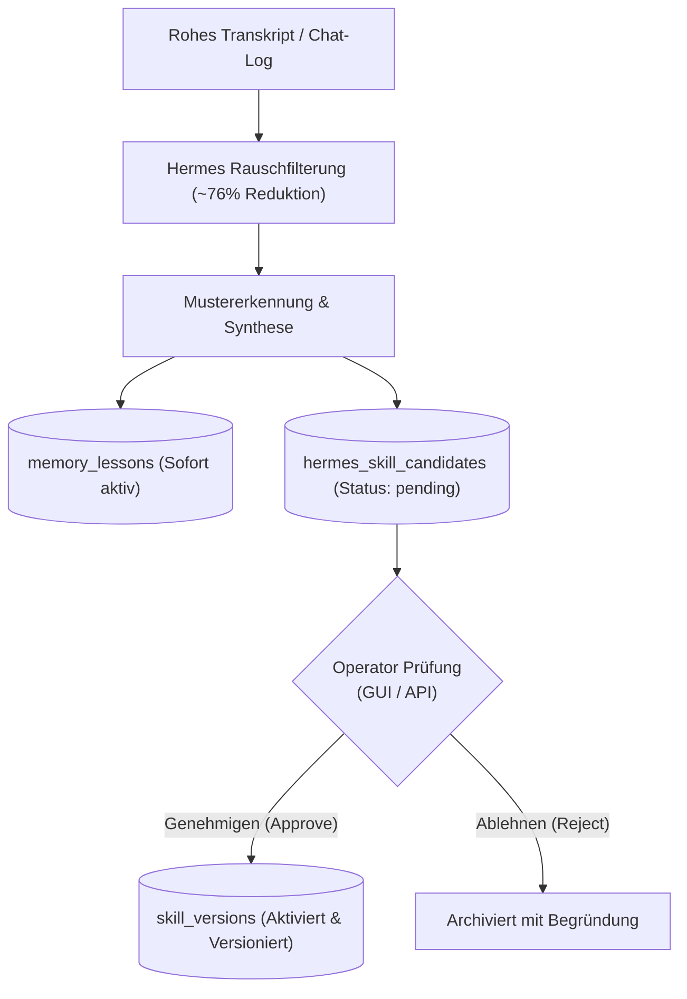

# Hermes Skill-Lernen & Destillation Engine v1.0.0

**Subsystem:** Ocean Subsystem *Hermes* (`category: "Skill-Destillation"`)  
**Status:** `active`  
**Referenz-Ticket:** `T-20261003-605028960` / Ocean Task 491  
**Datenbank-Bindung:** `bach.db` (`hermes_skill_candidates`, `hermes_distillation_runs`, `memory_lessons`, `skill_versions`)  

---

## 1. Übersicht & Zweck

Im operativen Alltag von BACH generieren Chat-Sessions (über ChatRuntime, Telegram, Antigravity- oder Claude-Transkripte) wertvolles Problemlösungs- und Handlungswissen. Allerdings besteht der überwiegende Teil einer rohen Konversation aus Rauschen: Begrüßungen, Füllfloskeln, redundanten Zwischenbestätigungen und unverarbeiteten Log- bzw. Traceback-Mengen.

Das Ocean-Subsystem **Hermes** realisiert den in der BACH-Kognitionstopologie (`memory.astro`, Baddeley-Modell) verankerten Lernpfad:
> *„Ohne Lernen kein Langzeitgedächtnis! Rohtext der Session wird analysiert, verdichtet und nach Rauschfilterung (Ziel ca. 76% Rauschfilter) in bach.db persisiert.“*

Hermes überführt flüchtige Dialoge in zwei dauerhafte Wissensarten:
1. **Lessons Learned:** Direkte Problem-Lösungs-Muster und Best Practices, die in `memory_lessons` abgelegt und von Agenten bei zukünftigen Aufgaben konsultiert werden.
2. **Skill-Kandidaten (SKILL.md):** Strukturierte, normgerechte Handlungsanweisungen mit standardisiertem YAML-Frontmatter nach dem SentinelFleet-Muster.

---

## 2. Human-in-the-Loop Governance

Um eine schleichende Kontaminierung oder das unkontrollierte Einschleusen ungetesteter Regeln zu verhindern, unterliegt Hermes einem strikten **Human-in-the-Loop** Prinzip:



1. **Destillation:** Hermes erzeugt einen Skill-Kandidaten mit `status = 'pending'`.
2. **Inspektion:** Der Operator kann den vollständigen `SKILL.md`-Entwurf im Memory-Dashboard oder über die API im Detail prüfen.
3. **Freigabe:** Bei Genehmigung (`POST /api/learning/hermes/candidates/{id}/approve`) wird der Skill mit `author: "hermes:operator"` in die offizielle `skill_versions`-Historie übernommen.
4. **Ablehnung:** Bei Ablehnung wird der Status auf `rejected` gesetzt und die Begründung revisionssicher protokolliert.

---

## 3. Rauschfilterung (~76% Rauschreduktion)

Die Rauschreduktions-Engine identifiziert und bereinigt:
- **Floskeln & Grußformeln:** Höflichkeitsfloskeln, Begrüßungen und Abschiedswünsche am Turn-Anfang und -Ende.
- **Log-Wüsten & Progress-Bursts:** Verdichtung riesiger Git- oder npm-Ausgaben auf Statusmarkierungen.
- **Traceback-Komprimierung:** Reduktion seitenlanger Python-Tracebacks auf die entscheidende Fehlermeldung und Kontextzeile.
- **System-Prompt Boilerplate:** Ausfiltern generischer CLI-Startprompts unter Bewahrung expliziter Sicherheits- und Lock-Guardrails.

Die berechnete Rauschreduktionsquote errechnet sich aus:
$$\text{Quote} = \left(1.0 - \frac{\text{Länge(Signal)}}{\text{Länge(Roh)}}\right) \times 100\,\%$$

Im Schnitt liegt die erreichte Quote zwischen **65% und 85%**, was der Vorgabe des kognitiven Memory-Plans entspricht.

---

## 4. SKILL.md Spezifikation

Erzeugte Skill-Kandidaten entsprechen dem kanonischen SentinelFleet-Format:

```yaml
---
name: learned-fastapi-ops
version: 1.0.0
role: Spezialisierter Assistent fuer FastAPI / Backend
category: dev
description: Autonom destillierter Skill aus Session chat-runtime:v1:abc
triggers:
  - "learned-fastapi-ops"
  - "führe learned-fastapi-ops aus"
provenance:
  distilled_by: hermes
  source_session: chat-runtime:v1:abc
  distilled_at: "2026-10-05T12:00:00Z"
  confidence: 0.88
  noise_reduction_percent: 76.4
---

# Learned-Fastapi-Ops

## 1. Übersicht & Zweck
...
## 2. Trigger-Bedingungen (Wann aktivieren?)
...
## 3. Verhaltensregeln & Leitplanken (Safety & Guardrails)
...
## 4. Standard-Ablauf (Workflow-Schritte)
...
## 5. Destillierte Signal-Muster
...
```

---

## 5. API-Referenz (`/api/learning/hermes/*`)

| Methode | Pfad | Beschreibung |
| :--- | :--- | :--- |
| `POST` | `/api/learning/hermes/distill` | Startet Destillation aus Transkript, Text oder `session_id` |
| `GET` | `/api/learning/hermes/candidates` | Listet Skill-Kandidaten (`status=pending\|approved\|rejected\|all`) |
| `GET` | `/api/learning/hermes/candidates/{id}` | Detailansicht eines Kandidaten inkl. vollem `SKILL.md` |
| `POST` | `/api/learning/hermes/candidates/{id}/approve` | Operator-Freigabe und Überführung nach `skill_versions` |
| `POST` | `/api/learning/hermes/candidates/{id}/reject` | Ablehnung eines Kandidaten mit Begründung |
| `GET` | `/api/learning/hermes/stats` | Aggregierte Live-Statistiken (Runs, Rauschfilterung %, Counts) |

---

## 6. Integration im Ocean Architektur-Manifest

In `GET /api/setup/ocean-map` wird Hermes nun als **aktives Subsystem** geführt:

```json
{
  "name": "Hermes",
  "category": "Skill-Destillation",
  "status": "active",
  "description": "Autonome Skill-Destillation aus Dialogen mit Rauschfilterung & Human-in-the-Loop Freigabe",
  "metrics": {
    "total_runs": 12,
    "average_noise_reduction_percent": 76.2,
    "pending_candidates": 3,
    "approved_candidates": 8,
    "total_lessons_learned": 45,
    "status": "active"
  }
}
```
