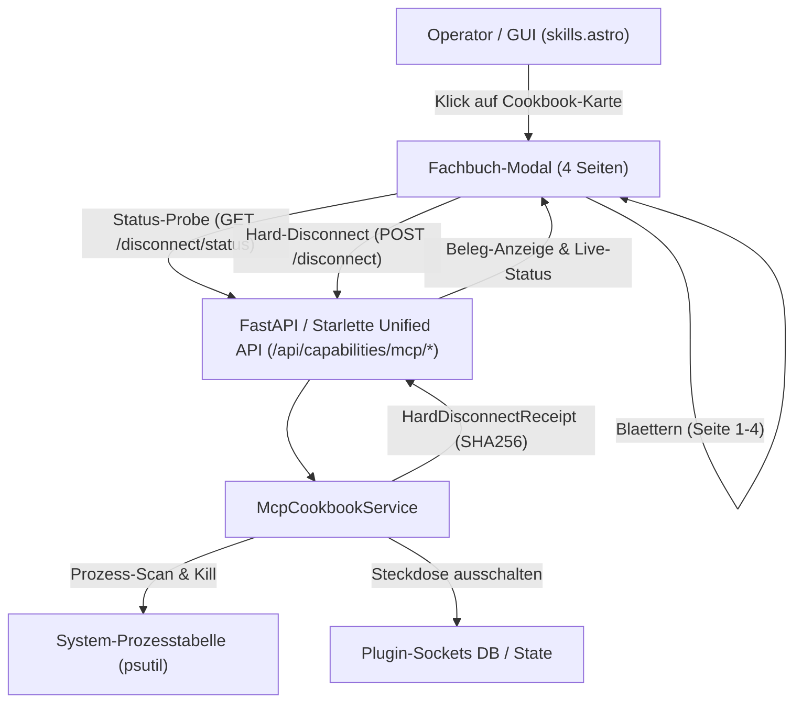

# MCP-Cookbooks Blätteransicht & Hard-Disconnect (v1)

**Dokument-ID:** `DOC-ARCH-MCP-COOKBOOK-v1`  
**Datum:** 2026-10-05  
**Autor:** `gemini@ASUS-GEI`  
**Referenzen:** Task #1691, Ticket `T-20261003-793817309`, GUX-030-066, GUX-030-067, GUX-030-068  
**Status:** Aktiv / Spezifiziert & Implementiert

---

## 1. Übersicht & Zielsetzung

MCP-Server (Model Context Protocol) stellen externe Werkzeuge und Schnittstellen für Agenten bereit. Um dem Bediener (Operator Lukas) volle Transparenz und Kontrollfähigkeit über aktive MCP-Server zu geben, implementiert dieses Modul zwei Kernfunktionen:

1. **Fachbuch-Blätteransicht für Dokumentationen (4 Seiten pro Cookbook):**
   - **Kapitel 1: Buchdeckel & Identität** – Transport-Protokoll, Version, Server-Kommando und Laufzeit-Status.
   - **Kapitel 2: Zutaten & Werkzeuge** – Vollständige Werkzeugliste mit Modus (`safe` vs. `full`) und Funktionssignaturen.
   - **Kapitel 3: Rezepte & Prompts** – Praxisnahe Aufrufmuster für Agenten mit 1-Klick-Kopierfunktion für die Zwischenablage.
   - **Kapitel 4: Absicherung & Hard-Disconnect** – Governance-Level, gesperrte Pfadmuster (z. B. `LOCK.user.*`, SSH-Schlüssel) und autoritative Prozess-Trennung.

2. **Autoritativer Hard-Disconnect mit Beleg (`HardDisconnectReceipt`):**
   - Physische Beendigung aller Server-Prozesse via `SIGTERM` bzw. `SIGKILL`.
   - Echzeit-Scan via `psutil` zur Verifikation, dass keine Waisenprozesse zurückbleiben (`remaining_processes_count: 0`).
   - Ausstellung eines kryptografisch signierten Belegs (`ellmos-mcp.hard-disconnect-receipt.v1`).
   - Automatische Abschaltung der zugehörigen Steckdose in `plugin_sockets`.

---

## 2. Architektur & Interaktion



---

## 3. Daten- und Belegschemata

### 3.1 Katalog-Schema (`ellmos-mcp.cookbook-catalog.v1`)
Jedes Buch im Katalog besitzt folgende Metadaten:
- `id`: Eindeutige Server-Kennung (z. B. `filecommander`, `open-compute`).
- `title`, `subtitle`, `cover_color`: Visuelle Darstellung im Bücherregal.
- `total_pages`: 4.
- `pages`:
  - `page_1_cover`: Server-Kommando, Protokollversion, Runtime-Status, Beschreibung.
  - `page_2_tools`: Liste aller MCP-Tools mit Modus (`safe`/`full`) und Beschreibung.
  - `page_3_recipes`: Workflow-Rezepte mit Anwendungszweck und Agenten-Prompt.
  - `page_4_governance`: Governance-Ebene, Pfad-Wächter-Muster und Abschaltsteuerung.

### 3.2 Beleg-Schema (`ellmos-mcp.hard-disconnect-receipt.v1`)
Nach erfolgreichem Hard-Disconnect wird ein Beleg ausgestellt:
```json
{
  "schema": "ellmos-mcp.hard-disconnect-receipt.v1",
  "receipt_id": "hdr-filecommander-1728128400000",
  "server_id": "filecommander",
  "issued_at": "2026-10-05T11:40:00Z",
  "host": "ASUS-GEI",
  "processes_terminated": [
    {"pid": 1234, "name": "python.exe", "cmdline": "..."}
  ],
  "remaining_processes_count": 0,
  "socket_updated": true,
  "signature": "e3b0c44298fc1c149afbf4c8996fb92427ae41e4649b934ca495991b7852b855"
}
```

---

## 4. Sicherheits- und Governance-Garantien

1. **Kein versehentlicher Selbstmord:** Der eigene API-Server-Prozess (`os.getpid()`) ist bei der Prozess-Identifikation strikt ausgeschlossen.
2. **Zero-Lingering-Garantie:** Ein erneuter Scan der Prozesstabelle stellt sicher, dass kein Zombie-Prozess weiterläuft.
3. **Fail-Closed Pfadsperren:** Standardmäßig gesperrte Pfadmuster (`LOCK.user.*`, `*.pem`, `*.key`, `id_ed25519*`) werden visualisiert und können nicht von Agenten-Prompts umgangen werden.
4. **Zwei-Wege-Synchronisation:** Das Ziehen des Steckers via Hard-Disconnect aktualisiert direkt die Steckdosenleiste (`plugin_sockets`), sodass die GUI stets einen konsistenten Zustand anzeigt.
