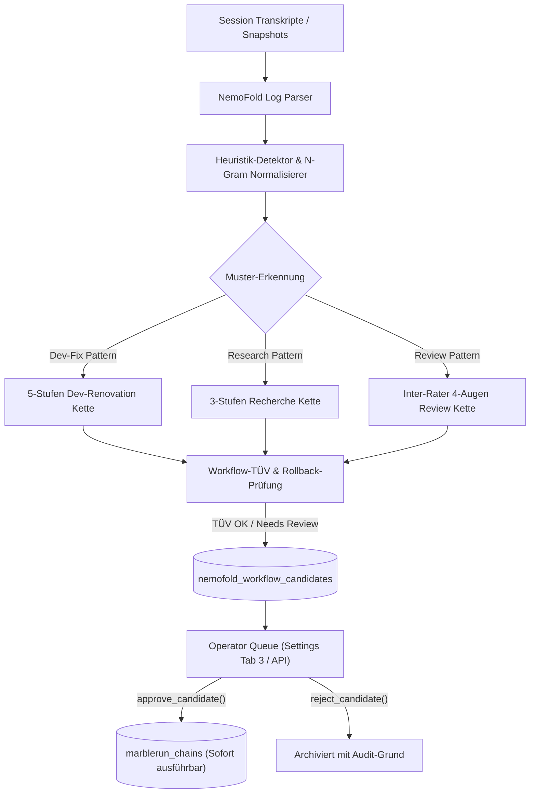
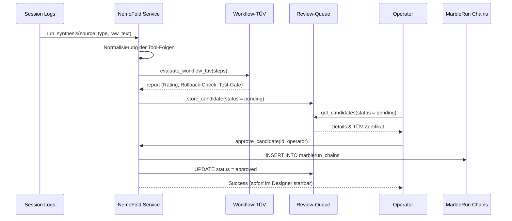

# NemoFold: Workflow-Lernen & Step-Ketten Synthese (Ocean Subsystem)

> Historisches Design vor Task #2000. Angaben zur Direktfreigabe, nativen Provideranbindung und aktiven Lessons gelten nicht als aktueller Source- oder Betriebsnachweis. Maßgeblich ist [LEARNING-PROMOTION-CONTRACT.md](LEARNING-PROMOTION-CONTRACT.md).

**Dokument-ID:** `NEMOFOLD-WORKFLOW-SYNTHESIS-v1`  
**Datum:** 2026-10-05  
**Verbund-Rolle:** Ocean Subsystem (Workflow-Lernen, Heuristik-Detektion, MarbleRun-Synthese)  
**Ticket:** `T-20261003-605028960` / Ocean Task 490 (#1688)  
**Status:** Aktiviert & Integriert  

---

## 1. Uebersicht & Zielsetzung

NemoFold erweitert das Kognitive Lern-System von BACH und Ocean um automatisiertes **Workflow-Lernen**:
Waehrend das Schwestersystem **Hermes** deklaratives Wissen und Einzelschritte aus Nutzer-Dialogen destilliert (`SKILL.md`),
beobachtet **NemoFold** mehrschrittige Werkzeugfolgen (Tool-Chains) autonomer Agenten-Sessions, erkennt wiederkehrende Heuristiken und synthetisiert daraus formale, wiederverwendbare Step-Ketten fuer den **MarbleRun Designer** und das **Toolchains**-Subsystem.

### Die 3 Kernsaeulen von NemoFold:
1. **Ablaufbeobachtung & Heuristik-Detektor:** Normalisiert rohe Werkzeug-Invocations (FileCommander, CodeCommander, Git, Pytest) aus Transkripten und Session-Snapshots in semantische Pipeline-Phasen.
2. **Ketten-Synthese:** Schlaegt strukturierte Step-Ketten mit Ein-/Ausgabe-Vertraegen, Rollback-Attributen und Agenten-Zuweisung vor.
3. **Workflow-TÜV & Rollback-Schutz:** Validiert jede Kette gegen Sicherheitsrichtlinien (kein unautorisierter Direct-Main-Push) und verlangt bei modifizierenden Schritten ein 2-Phasen Action Journal (`nemofold.action-journal.v1`).

---

## 2. Architektur & Datenfluss



---

## 3. Datenbank-Schema

### 3.1 `nemofold_workflow_candidates`
Tabelle fuer gelernte Ketten-Kandidaten vor der Freigabe:

```sql
CREATE TABLE IF NOT EXISTS nemofold_workflow_candidates (
    id INTEGER PRIMARY KEY AUTOINCREMENT,
    chain_name TEXT NOT NULL UNIQUE,
    title TEXT NOT NULL,
    description TEXT,
    trigger_type TEXT DEFAULT 'manual',
    steps_json TEXT NOT NULL,
    confidence_score REAL DEFAULT 0.8,
    tuv_status TEXT DEFAULT 'certified',
    tuv_report_json TEXT,
    status TEXT DEFAULT 'pending', -- 'pending' | 'approved' | 'rejected'
    provenance_json TEXT,
    created_at TIMESTAMP DEFAULT CURRENT_TIMESTAMP,
    updated_at TIMESTAMP DEFAULT CURRENT_TIMESTAMP,
    reviewed_by TEXT,
    review_notes TEXT,
    promoted_to_chain_id INTEGER
);
```

### 3.2 `nemofold_synthesis_runs`
Protokoll aller Syntheselaeuefe:

```sql
CREATE TABLE IF NOT EXISTS nemofold_synthesis_runs (
    id INTEGER PRIMARY KEY AUTOINCREMENT,
    source_type TEXT NOT NULL,
    source_ref TEXT,
    patterns_detected INTEGER DEFAULT 0,
    chains_synthesized INTEGER DEFAULT 0,
    created_at TIMESTAMP DEFAULT CURRENT_TIMESTAMP,
    details_json TEXT
);
```

---

## 4. API-Endpunkte

| Methode | Pfad | Beschreibung | Auth / Gate |
| :--- | :--- | :--- | :--- |
| `POST` | `/api/learning/nemofold/synthesize` | Fuehrt Heuristik-Detektion und Ketten-Synthese aus | Token erforderlich |
| `GET` | `/api/learning/nemofold/candidates` | Listet Ketten-Kandidaten (Filter: `status`) | Frei (`EXEMPT_API_PATHS`) |
| `GET` | `/api/learning/nemofold/candidates/{id}` | Detailansicht eines Kandidaten inkl. Steps & TÜV | Token erforderlich |
| `POST` | `/api/learning/nemofold/candidates/{id}/approve` | Ueberfuehrt Kette nach `marblerun_chains` | Token erforderlich |
| `POST` | `/api/learning/nemofold/candidates/{id}/reject` | Lehnt Kette mit Begruendung ab | Token erforderlich |
| `GET` | `/api/learning/nemofold/stats` | Aggregierte Kennzahlen fuer Dashboard & Ocean-Map | Frei (`EXEMPT_API_PATHS`) |

---

## 5. Sequence Diagram: Freigabe-Workflow



---

## 6. Abnahme-Kriterien & Sicherheits-Garantien

1. **Rollback-Schutz:** Schreibende Schritte muessen als reversibel deklariert und an das NemoFold Two-Phase Action Journal gebunden sein.
2. **Push-Schutz:** Direkte Push-Kommandos auf `main` ohne PR-Erstellung werden vom TÜV blockiert (`rating: F / rejected`).
3. **Fail-Closed Governance:** Kein automatischer Direkteinbau in das aktive System ohne menschliche oder explizite Operator-Genehmigung (`status: pending` -> `approve_candidate`).
