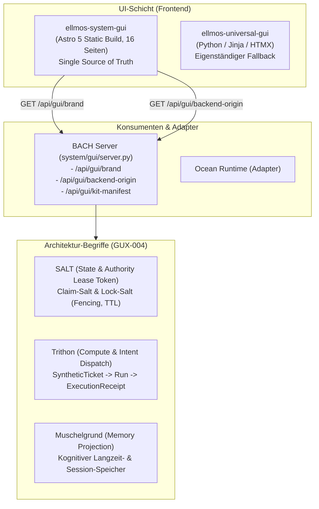

# Shared GUI Kit, Universal Fallback & Backend Origin Contract (v1.0)

**Dokument-ID:** `DOC-ARCH-GUI-GUX-001-004-v1.0`  
**Referenz:** Hauptticket `T-20261003-793817309`, Task #1695  
**Geltungsbereich:** BACH (`system/gui`), Ocean (`open-ocean`), `ellmos-system-gui`, `ellmos-universal-gui`  
**Stand:** 2026-10-05  

---

## 1. Übersicht & Zielsetzung

Dieses Dokument fixiert die verbindliche Schnittstellen- und Architektur-Abnahme für die modulare Benutzeroberfläche und deren Backend-Anbindung im BACH/Ocean-Verbund (GUX-001–004 sowie GUX-092).

---

## 2. GUX-001: Gemeinsames GUI-Kit & Branding-Vertrag

1. **Eigenständiges Repository:**  
   `ellmos-system-gui` ([https://github.com/ellmos-ai/ellmos-system-gui](https://github.com/ellmos-ai/ellmos-system-gui)) ist das alleinige Quell-Repository für das Frontend.
2. **Gepinnte Version:**  
   - Commit: `25fbd5db153347dfbc8341fdf47a3f1d3632a3a6`
   - Release-Archiv: `ellmos-system-gui-0.1.0-25fbd5db1533.zip`
   - Archiv-SHA-256: `04357d624757e14bd0f9b090063dcab70df5aaa4cd9deb27401c7071be405a2c`
   - Manifest: `dist/dist-manifest.json` (`schema: ellmos-system-gui.dist.v1`, 16 HTML-Seiten).
3. **Branding-Endpunkt (`GET /api/gui/brand`):**  
   - Schema: `ellmos-system-gui.brand.v1`
   - Erlaubt konsumentenspezifische Anpassung (`label`, `product`, `logo_text`, `logo_path`, `theme`).
   - Validierung: Maximallänge 48 Zeichen für Texte; `logo_path` muss strikt auf `/static/branding/*.png|webp` matchen und darf kein `..` enthalten; Themes: `dark`, `light`, `ocean`, `warm`.

---

## 3. GUX-002: Universal GUI Fallback

1. **Eigenständiges Fallback-Modul:**  
   `ellmos-universal-gui` (basiert auf `ellmos-unified-gui`) bleibt ein vollständig eigenständiger Fallback.
2. **Architektur-Trennung:**  
   - Haupt-GUI: Astro 5 kompiliertes Static-HTML (`ellmos-system-gui`).
   - Fallback-GUI: Server-Side Rendered Python/FastAPI mit Jinja2 und HTMX (`ellmos-unified-gui`).
3. **Paket- & Manifest-Identität:**  
   - PyPI / Paketname: `ellmos-unified-gui`
   - Manifest: `ellmos-module.v2.json` mit Capability `operator.ui` und `unified-gui.host`.
   - Eigener Installer und eigene Startbefehle; keine Vermischung mit dem Astro-Build.

---

## 4. GUX-003: Backend-Herkunft & Read-Only Non-Claim-Garantie

1. **Metadaten-Endpunkt (`GET /api/gui/backend-origin`):**  
   - Schema: `ellmos-system-gui.backend-origin.v1`
   - Liefert: `mode` (`server | local | unknown`), `declared_mode`, `reason_code`, `instance_label`, `connection_verified`, `schema_verified`, `instance_verified`, `adapter_binding_verified`, `observed_at`.
2. **Trennung von Konfiguration und Empirie:**  
   - `declared_mode` dokumentiert die Konfiguration.
   - `mode` wird NUR auf `server` oder `local` gesetzt, wenn `connection_verified`, `schema_verified`, `instance_verified` und `adapter_binding_verified` alle `True` sind.
3. **Non-Claim-Garantie:**  
   - Ein reiner Lesestatus (`GET /api/gui/backend-origin`) berechtigt NICHT zu Task-Claims.
   - `has_claim_authority` ist im Beobachter-/Read-Only-Modus strikt `False`.
   - Operative Claims erfordern zwingend eine gültige Salt-Lease (`claim-salt`) auf der Lead TaskDB.

---

## 5. GUX-004: Schärfung der Architektur-Begriffe

| Begriff | Rolle & Bedeutung | Abgrenzung / Schutzklausel |
|---|---|---|
| **SALT** | State & Authority Lease Token (`claim-salt`, `lock-salt`). Koordiniert atomare Task-Leases und Ressourcen-Locks mit Fencing-Counter und TTL. | Erteilt **keine** automatischen Schreibrechte und bricht **keine** lokalen `LOCK*.txt`-Dateien. |
| **Trithon** | Multi-Host Intent Dispatch & Execution Abstraktion. Koordiniert Workloads zwischen Mac Studio (Lead), Laptop (ASUS-GEI) und Workstation. | Erzeugt kryptografisch nachvollziehbare `ExecutionReceipt`s; ist keine Speicher- oder Datenbank-Authority. |
| **Muschelgrund** | Kognitiver Langzeit- & Episodischer Speicher (`system/hub/_services/memory`). | Strikt getrennt von Server-, Lead- und Cluster-Topologie; keine Vermischung mit TaskDB oder Leases. |

---

## 6. GUX-092: Standalone-Dashboard-Funktionen & Deprecation Gate

1. **Routen-Integration:**  
   Bestehende Standalone-Funktionen sind in die 16 Astro-Hauptseiten integriert:
   - `/tasks` -> Modulares Aufgabenboard (`tasks.html`)
   - `/skills` -> Steckdosenleiste, Cookbooks & SentinelFleet (`skills.html`)
   - `/governance` -> Decision-Clicker, Lock-Monitor (`governance.html`)
   - `/agenten/*` -> Fabrika, Living/Running, MarbleRun, Sessions
2. **Deprecation Gate:**  
   Die Legacy-Templates in `system/gui/templates/` bleiben als Fail-Open-Fallback aktiv erhalten, bis für jede Route Datenparität, Widget-Funktionen und Adapter-Bindung vollständig nachgewiesen sind.
