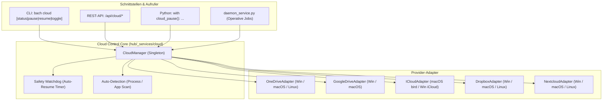
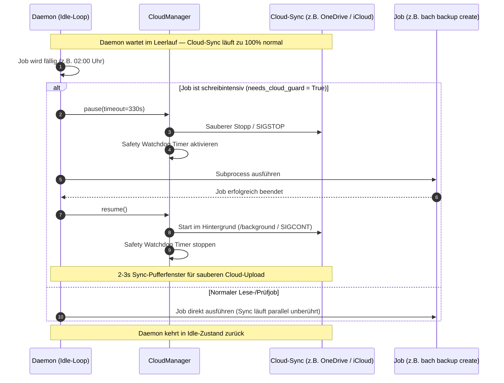
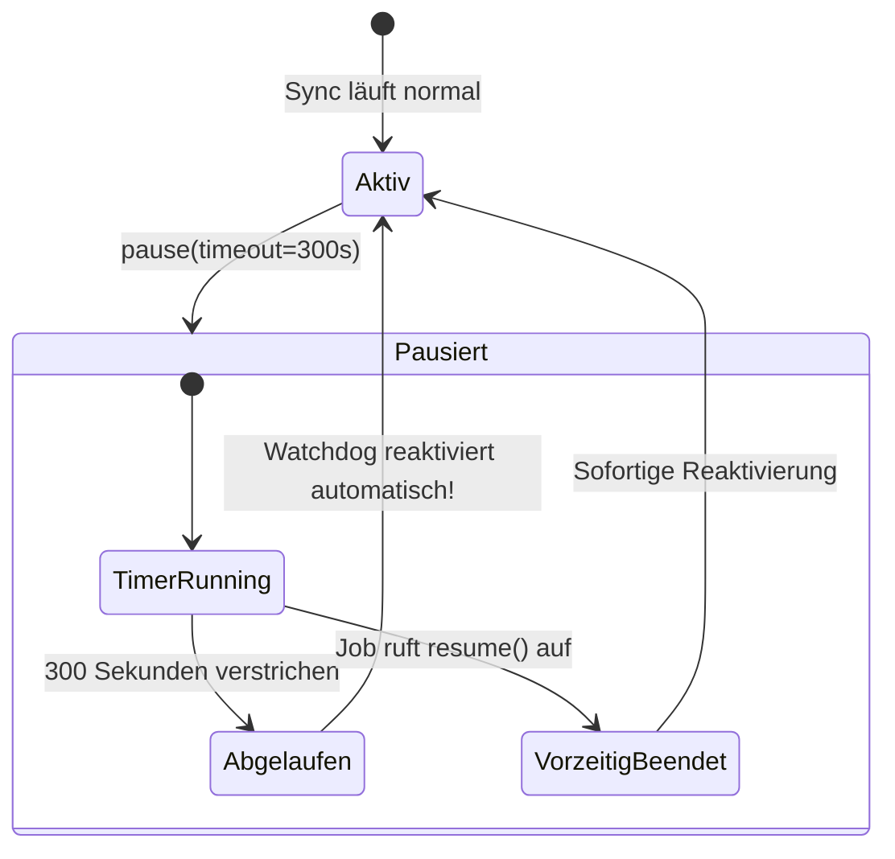

# Architektur-Dokumentation: BACH Cloud-Control Service

**Version:** 1.0.0  
**Datum:** 2026-09-09  
**Status:** Aktiv  
**Modul:** `system/hub/_services/cloud/`  
**CLI:** `bach cloud`  
**API:** `/api/cloud/*`  

---

## 1. Problemstellung & Motivation

In verteilten Arbeitsumgebungen und Multi-Device-Setups greifen KI-Agenten, Hintergrunddienste und der Nutzer gleichzeitig auf Dateien in Cloud-Verzeichnissen zu (Microsoft OneDrive, Apple iCloud Drive, Google Drive, Dropbox, Nextcloud).

### Historische Konflikte:
1. **SQLite-WAL-Konflikte:** SQLite schreibt Transaktionen in Write-Ahead-Log-Dateien (`.db-wal`). Wenn ein Cloud-Sync-Client diese während eines aktiven Schreibzugriffs sperrt, wirft SQLite `sqlite3.OperationalError: database is locked`. OneDrive erzeugte dadurch durchnummerierte Duplikate (`bach 2.db-wal` bis `bach 12.db-wal`).
2. **Dokumenten- und Markdown-Kollisionen:** Parallele Schreibvorgänge führten zu Tausenden Konfliktdateien (`* - ASUS-GEI.md` / `* - WORKSTATION-LG.md`).
3. **Alte Fehl-Implementierung (`proc.suspend()`):** Früher fror der `daemon_service.py` den Windows-Prozess von OneDrive beim Start dauerhaft ein und taute ihn erst beim Herunterfahren auf. Dies führte zu stummen Sync-Blockaden über Tage hinweg.

---

## 2. Architektur & Komponenten

Der **Cloud-Control-Service** entkoppelt die Cloud-Steuerung von einzelnen Skripten und stellt eine providerneutrale Schnittstelle für CLI, Web-API und Python-Pipelines bereit.



---

## 3. Operativer Job-Ablauf im Daemon

Im Gegensatz zur alten Dauer-Blockade pausiert der sanierte `daemon_service.py` Cloud-Sync-Clients **ausschließlich operativ während der tatsächlichen Ausführung schreibintensiver Jobs** (z. B. nächtliches Datenbank-Backup oder Memory-Konsolidierung).



---

## 4. Ausfallsicherer Watchdog (Fail-Safe)

Bleibt ein Job hängen oder stürzt der ausführende Prozess unvorhergesehen ab, greift der **Safety-Watchdog**:



---

## 5. Provider-Details & Plattform-Befehle

| Provider | Plattform | Pause-Mechanismus | Resume-Mechanismus |
| :--- | :--- | :--- | :--- |
| **Microsoft OneDrive** | Windows | `OneDrive.exe /shutdown` (wartet 2s) | `OneDrive.exe /background` (detached) |
| | macOS | `osascript -e 'quit app "OneDrive"'` | `open -a "OneDrive" --background` |
| | Linux | `pkill -STOP onedrive` | `pkill -CONT onedrive` |
| **Google Drive** | Windows | `taskkill /IM GoogleDriveFS.exe` | Aufruf von `launch.bat` |
| | macOS | `osascript -e 'quit app "Google Drive"'` | `open -a "Google Drive" --background` |
| **Apple iCloud** | macOS | `killall -STOP bird` | `killall -CONT bird` |
| | Windows | `taskkill /IM iCloudDrive.exe` | Aufruf von `iCloud.exe` |
| **Dropbox** | Windows | `taskkill /IM Dropbox.exe` | Aufruf von `Dropbox.exe` |
| | macOS | `osascript -e 'quit app "Dropbox"'` | `open -a "Dropbox" --background` |
| | Linux | `dropbox stop` | `dropbox start` |
| **Nextcloud** | Windows | `nextcloud.exe --quit` | `nextcloud.exe --background` |
| | macOS | `osascript -e 'quit app "nextcloud"'` | `open -a "nextcloud" --background` |
| | Linux | `nextcloud --quit` | `nextcloud &` |

---

## 6. Code-Beispiele & Verwendung

### A. Im Python-Code via Context-Manager
```python
from hub._services.cloud import cloud_pause

# Automatisches Pausieren mit garantiertem Resume im finally:
with cloud_pause(timeout=120):
    # Gefahrlose Massen-Schreiboperationen oder Reorganisation
    datenbank.exportieren()
    dateien.verschieben()
# Hier läuft Cloud-Sync bereits wieder!
```

### B. Auf der Kommandozeile (CLI)
```bash
# Status aller Provider anzeigen
bach cloud status

# Gezielt OneDrive für 2 Minuten pausieren
bach cloud pause onedrive -t 120

# Alle pausierten Provider sofort wieder aktivieren
bach cloud resume

# Umschalten (Toggle)
bach cloud toggle
```
